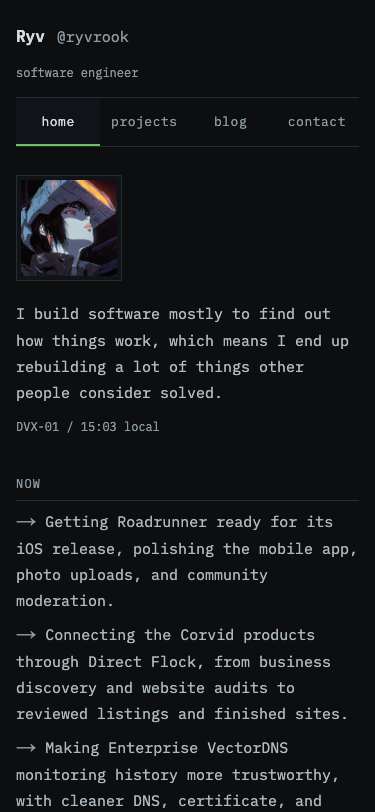

# Ryv: mobile review — 2026-09-07

1. Home and navigation: readable stacked layouts, all navigation visible and touch-sized.
2. Project archive: descriptions use the available width; logos no longer reserve a full-height gutter.
3. Project details: metadata wraps; charts fit; architecture diagrams scroll inside their container.
4. Writing archive: article summaries use full width with date/read time above on phones.
5. Articles and sharing: readable prose, keyboard-accessible code scrolling, native sharing with fallback, clipboard success and denied-access feedback.
6. Contact: working destinations and no empty/placeholder email actions.
7. Not found: return-home navigation verified.

## Validation

- Production build and TypeScript checks passed.
- 41 content routes checked in Chromium at 320, 375, 390, 430, 768 and 1280px. No document overflow or JavaScript exceptions.
- Navigation, archive/detail/back links, touch dismissal, Escape, clipboard success/failure and share API dispatch checked.
- Internal exported link targets checked.
- Automated mobile accessibility checks cover home, both archives, contact, a project detail and a post. This does not certify full accessibility compliance.
- Native share dispatch tested with a browser stub; physical iOS/Android share sheets and Safari were not tested.

Mobile screenshots were captured and reviewed during this pass. No changes were made to other projects.

